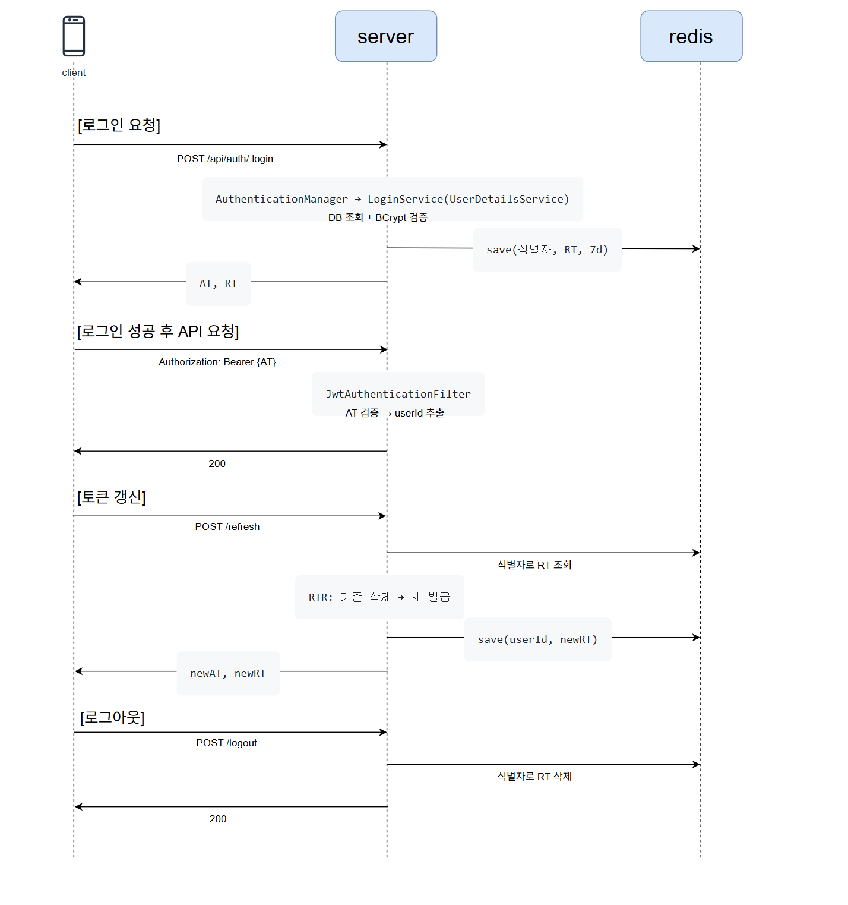
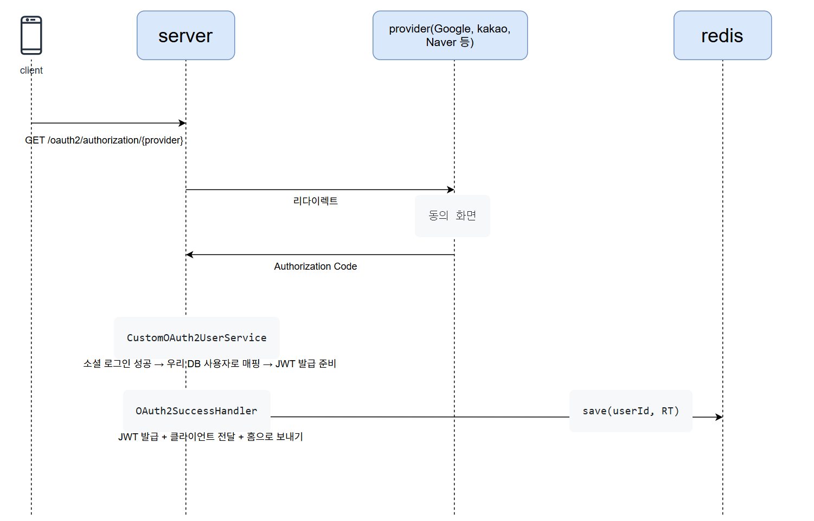

# OAuth 2.0 · JWT flow

ID/PW 로그인과 소셜 로그인에서 JWT를 발급·검증·갱신하는 흐름을 코드로 확인합니다.

## 브랜치 구성

| 브랜치 | 내용 |
|---|---|
| `main` | OAuth2 스켈레톤 — JWT·DB·Redis 없음 (출발점) |
| `base/jwt-only` | ID/PW 로그인 → JWT + Refresh lifecycle (단일 세션) |
| `base/oauth2-foundation` | 소셜 로그인 → JWT + 3가지 저장 패턴 비교 |
| `feature/multi-session` | `base/jwt-only` 확장 → jti 기반 멀티 세션 |

**추천 순서:** `base/jwt-only` → `base/oauth2-foundation`  
단일 세션의 한계를 이해했다면 `feature/multi-session`에서 jti 도입 diff를 확인합니다.

---

## 브랜치별 로그인 흐름

### base/jwt-only — ID/PW → JWT



### base/oauth2-foundation — 소셜 로그인 → JWT



**패턴별 토큰 전달:** `cookie` — HttpOnly 쿠키 AT+RT · `memory` — body AT + HttpOnly RT · `localstorage` — redirect `#AT&RT` (⚠️ 학습용)

### feature/multi-session — jti 기반 멀티 세션

```
클라이언트 A            서버                        Redis
     │                   │                            │
     │─ POST /login ───>│                            │
     │                   │ Refresh Token 생성         │
     │                   │ jti = UUID ("aaa")         │
     │                   │── save("aaa", userId) ───>│  refresh:aaa = 100
     │<── {AT-A, RT-A} ──│                            │
     │                   │                            │
클라이언트 B             │                            │
     │─ POST /login ───>│                            │
     │                   │ jti = UUID ("bbb")         │
     │                   │── save("bbb", userId) ───>│  refresh:bbb = 100
     │<── {AT-B, RT-B} ──│                            │  (aaa는 그대로)
     │                   │                            │
     │  [A가 토큰 갱신]   │                            │
     │─ POST /refresh ──>│                            │
     │  {refreshToken:   │── findByJti("aaa") ──────>│
     │   RT-A}           │<── userId: 100 ───────────│
     │                   │── deleteByJti("aaa") ────>│  refresh:aaa 삭제
     │                   │── save("ccc", userId) ───>│  refresh:ccc = 100
     │<── {newAT, newRT} ─│                            │
     │                   │                            │
     │  B는 여전히 유효  │                            │  refresh:bbb = 100 (유지)
     │                   │                            │
     │  [A만 로그아웃]    │                            │
     │─ POST /logout ───>│                            │
     │  {refreshToken:   │── deleteByJti("ccc") ────>│  refresh:ccc 삭제
     │   newRT}          │                            │
     │                   │                            │  refresh:bbb = 100 (유지)
```

---

## 실행 (main)

1. `.env.example` 복사 후 `.env` 작성 (OAuth Client ID/Secret)
2. Provider Redirect URI: `http://localhost:8080/login/oauth2/code/{google|kakao|naver}`

```bash
./gradlew bootRun
```

## 다음 단계

```bash
git checkout base/jwt-only
```
