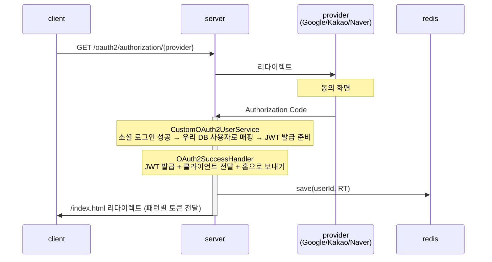

# OAuth2 + JWT 현업 수준 인증 시스템 설계

**날짜**: 2026-07-02  
**목적**: 학습용 STAGE 구조를 실제 현업 수준의 OAuth2 + JWT 인증 시스템으로 전환. 각 JWT 저장 패턴을 Git 브랜치별로 분리하여 비교 학습 가능하도록 구성.

---

## 1. 브랜치 구조

```
main                          ← 현재 코드 정리 (STAGE 파일 삭제, 주석 정비)
└─ base/oauth2-foundation     ← OAuth2 + PostgreSQL User 저장 + REST API 뼈대 (JWT 없음)
     ├─ pattern/cookie-only        ← JWT 발급 + HttpOnly Cookie 저장 (현업 표준)
     ├─ pattern/memory-access      ← Access Token 메모리 + Refresh Token HttpOnly Cookie
     └─ pattern/localstorage       ← Access+Refresh 모두 localStorage (경고 포함, 학습용)
```

각 패턴 브랜치는 `base/oauth2-foundation`에서 분기. `git diff base/oauth2-foundation pattern/cookie-only`로 패턴별 차이점을 명확하게 확인 가능.

---

## 2. 기술 스택

| 항목 | 선택 |
|---|---|
| Java | 17 |
| Spring Boot | 3.x |
| 빌드 | Gradle Kotlin DSL |
| DB | PostgreSQL (Docker) |
| 캐시/토큰 저장 | Redis (Docker) |
| ORM | Spring Data JPA |
| OAuth2 Providers | Google, Kakao, Naver |
| JWT 라이브러리 | `io.jsonwebtoken:jjwt` |
| 프론트엔드 | 바닐라 HTML + fetch (테스트용) |

---

## 3. 레이어 아키텍처

모든 브랜치에 동일하게 적용되는 패키지 구조:

```
com.auth.practice
├── domain/
│   ├── user/
│   │   ├── User.java               (JPA 엔티티: id, email, name, provider, providerId, profileImageUrl, role, createdAt)
│   │   ├── UserRole.java           (enum: USER, ADMIN)
│   │   └── UserRepository.java     (인터페이스)
│   ├── oauth/
│   │   ├── OAuth2UserInfo.java     (Provider별 사용자 정보 추상화 — 현재 코드 유지)
│   │   └── OAuth2Provider.java     (enum: GOOGLE, KAKAO, NAVER — 현재 코드 유지)
│   └── token/                      (패턴 브랜치에서 추가)
│       └── RefreshToken.java       (값 객체: userId, token, expiresAt)
│
├── infrastructure/
│   ├── persistence/
│   │   ├── UserJpaRepository.java  (Spring Data JPA)
│   │   └── RedisTokenRepository.java (Refresh Token CRUD — 패턴 브랜치에서 추가)
│   └── security/
│       ├── config/
│       │   └── SecurityConfig.java (SecurityFilterChain 설정)
│       ├── oauth/
│       │   ├── CustomOAuth2UserService.java        (DB upsert 추가)
│       │   ├── CustomOAuth2User.java               (현재 코드 유지)
│       │   ├── OAuth2AuthenticationSuccessHandler.java (패턴별 토큰 전달 방식 상이)
│       │   └── userinfo/                           (현재 코드 유지)
│       └── jwt/                                    (패턴 브랜치에서 추가)
│           ├── JwtProvider.java                    (토큰 생성/검증)
│           └── JwtAuthenticationFilter.java        (요청별 토큰 파싱, 패턴별 상이)
│
├── application/
│   └── auth/
│       └── AuthService.java        (토큰 발급/갱신/폐기 오케스트레이션)
│
    └── presentation/
        ├── controller/
        │   └── AuthController.java (/api/auth/me, /api/auth/refresh, /api/auth/logout)
        └── dto/
            ├── TokenResponse.java
            └── UserInfoResponse.java

resources/
└── static/
    └── index.html                  (패턴별 테스트용 바닐라 HTML + fetch, 패턴 브랜치마다 다른 내용)
```

---

## 4. 전체 인증 흐름

### 4-1. OAuth2 로그인 흐름 (모든 브랜치 공통)




**OAuth ↔ JWT 책임 분리 원칙:**
- `OAuth2SuccessHandler` → OAuth 완료 후 `AuthService.issueTokens()`를 호출할 뿐, JWT를 직접 다루지 않음
- `JwtProvider` → 순수 토큰 생성/검증 유틸리티
- `AuthService` → OAuth 결과와 JWT 라이프사이클을 조율하는 오케스트레이터

### 4-2. 토큰 갱신 흐름 (Refresh Token Rotation)

```
1. POST /api/auth/refresh
2. Refresh Token 추출 (패턴별 위치 상이: 쿠키 or 요청 body)
3. JwtProvider로 서명 검증
4. Redis에서 해당 userId의 저장된 토큰과 일치 여부 확인
5. [Refresh Token Rotation]
   ├─ 기존 Refresh Token Redis에서 삭제
   ├─ 새 Access Token + 새 Refresh Token 발급
   └─ 새 Refresh Token Redis에 저장
6. 패턴별 방식으로 토큰 반환
```

### 4-3. 로그아웃 흐름

```
1. POST /api/auth/logout
2. Redis에서 해당 userId의 Refresh Token 삭제
3. 패턴별 쿠키 삭제 (cookie 패턴) 또는 클라이언트 처리 안내
```

---

## 5. 패턴별 차이점

### pattern/cookie-only

- **Access Token**: `access_token` HttpOnly Cookie (Secure, SameSite=Strict)
- **Refresh Token**: `refresh_token` HttpOnly Cookie (Secure, SameSite=Strict, Path=/api/auth/refresh)
- **API 요청**: 쿠키 자동 전송 (별도 헤더 불필요)
- **CSRF 방어 필요**: O (SameSite=Strict으로 대부분 방어, 추가로 Double Submit Cookie 패턴)
- **XSS 위험**: 낮음 (JS로 토큰 접근 불가)

### pattern/memory-access

- **Access Token**: 로그인 응답 body로 전달 → 클라이언트 JS 변수에만 보관 (탭 닫으면 소멸)
- **Refresh Token**: `refresh_token` HttpOnly Cookie
- **API 요청**: `Authorization: Bearer {accessToken}` 헤더
- **Silent Refresh**: Access Token 만료(401) 시 `/api/auth/refresh` 자동 호출
- **XSS 위험**: 낮음 (Access Token은 메모리에만, Refresh Token은 HttpOnly)

### pattern/localstorage

- **Access Token**: 응답 body → localStorage 저장
- **Refresh Token**: 응답 body → localStorage 저장
- **API 요청**: `Authorization: Bearer {accessToken}` 헤더
- **XSS 위험**: **높음** — 코드 내 경고 주석 명시
- **목적**: 이 패턴이 왜 위험한지 직접 경험하기 위한 학습용

---

## 6. 주요 보안 설정

| 항목 | 설정값 | 이유 |
|---|---|---|
| Access Token TTL | 15분 | 탈취 시 피해 최소화 |
| Refresh Token TTL | 7일 | UX와 보안 밸런스 |
| Refresh Token Rotation | 활성화 | 탈취 감지 가능 |
| HttpOnly Cookie | 활성화 | XSS 방어 |
| Secure Cookie | 활성화 (HTTPS) | 중간자 공격 방어 |
| SameSite=Strict | cookie 패턴 | CSRF 방어 |
| 세션 | Stateless | JWT 기반, 서버 세션 없음 |

---

## 7. 주석 전략

코드 내 현업 학습용 주석 prefix 규칙:

```java
// [왜?]       설계 결정 이유 설명 (왜 이렇게 했는가?)
// [보안]      보안 고려사항 (공격 유형, 방어 방법)
// [현업패턴]  실제 현업에서 이 패턴을 쓰는 이유
// [주의]      잘못 쓰면 취약점이 되는 코드
// [TODO]      추후 개선 가능한 부분
```

---

## 8. 삭제 대상 파일 (STAGE 관련)

구현 시 main 브랜치에서 삭제:

- `STAGE1_COMPLETION.md`
- `STAGE2_COMPLETION.md`
- `src/main/resources/templates/` (Thymeleaf 템플릿 전체 — REST API 전환)
- `src/main/resources/application-local.yaml.example` (PostgreSQL + Redis 설정 포함한 새 example로 교체)

---

## 9. 새로 추가되는 의존성 (base 브랜치)

```kotlin
// PostgreSQL
runtimeOnly("org.postgresql:postgresql")

// Spring Data JPA
implementation("org.springframework.boot:spring-boot-starter-data-jpa")

// Redis
implementation("org.springframework.boot:spring-boot-starter-data-redis")

// JWT (패턴 브랜치)
implementation("io.jsonwebtoken:jjwt-api:0.12.6")
runtimeOnly("io.jsonwebtoken:jjwt-impl:0.12.6")
runtimeOnly("io.jsonwebtoken:jjwt-jackson:0.12.6")
```
